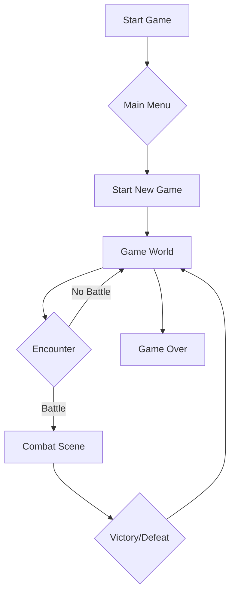

```markdown
# 🎨 tiles_test: A Next.js RPG Adventure  🚀


```
```ascii
  _.--""--._
 .'          `.
/   O      O   \
|    \  ^^  /    |
\   `-----'   /
 `. _______ .'
   //_____\\
  (( ____ ))
   `-----'
  Tiles Test
```

> Embark on an exciting RPG adventure built with Next.js! Explore a vibrant world, battle monsters, and uncover hidden secrets.


---

## 🌟 Feature Highlights ✨

*   **Stunning 2D Graphics:**  Experience beautifully rendered pixel art environments and characters. 🎨
*   **Engaging Turn-Based Combat:**  Engage in strategic battles against challenging monsters. ⚔️
*   **Interactive Exploration:** Discover a vast world filled with secrets and hidden treasures. 🗺️
*   **Dynamic Storyline:** Immerse yourself in a captivating narrative that unfolds as you progress. 📖
*   **Intuitive Controls:**  Enjoy smooth and responsive gameplay with easy-to-learn controls. 🎮
*   **Customizable Characters:**  (Future Feature) Create and personalize your own unique hero. 🦸‍♀️


---

## 🛠️ Tech Stack 📦

| Technology       | Badge                                                                     |
|-----------------|--------------------------------------------------------------------------|
| Next.js         |  |
| React            |      |
| JavaScript       |  |
| TypeScript       |  |
| Node.js          |    |
| Three.js         |    |


---

## 🚀 Quick Start ⚡

1.  Clone the repository: `git clone https://github.com/nikhilsinghrathore1/tiles_test.git`
2.  Navigate to the project directory: `cd tiles_test`
3.  Install dependencies: `npm install`
4.  Start the development server: `npm run dev`


---

## 📖 Detailed Usage 📚

This section will cover the implementation details of the game mechanics, including movement, combat, and character interaction.

**Movement:**

The player character moves using click-based movement.  Clicking on the canvas sets a target position for the character. The game uses a world-following camera to provide a seamless experience.

```javascript
// Example of movement logic (simplified)
player.move(targetX, targetY);
```

**Combat:**

Turn-based combat is initiated when the player enters a battle zone. The player selects attacks from a menu, and the enemy AI selects attacks automatically.

```javascript
// Example of attack logic (simplified)
player.attack(enemy, selectedAttack);
```

**Character Interaction:**

Press the spacebar to interact with characters.  Conversations are implemented using a simple dialogue system.


---

## 🏗️ Project Structure 📁

```
tiles_test/
├── app/
│   ├── globals.css
│   ├── layout.tsx
│   └── page.tsx
├── public/
│   ├── data/
│   │   ├── attacks.js
│   │   ├── battleZones.js
│   │   ├── characters.js
│   │   ├── collisions.js
│   │   └── monsters.js
│   ├── img/
│   │   ├── ... (image assets)
│   ├── audio/
│   │   ├── ... (audio assets)
│   ├── index.js
│   ├── battleScene.js
│   └── classes.js
├── package.json
├── next.config.ts
├── postcss.config.mjs
└── tsconfig.json

```

---

## 🎯 API Documentation 📊

**(This section will be expanded with detailed API documentation in a future update.)**


---

## 🔧 Configuration Options ⚙️

**(This section will be expanded with detailed configuration options in a future update.)**


---

## 📸 Screenshots/Demo 📸

**(Screenshots and a demo video will be added in a future update.)**


---

## 🤝 Contributing Guidelines 🌟

We welcome contributions from the community! Please follow these guidelines:

1.  Fork the repository.
2.  Create a new branch for your feature or bug fix.
3.  Make your changes and ensure they pass all tests.
4.  Create a pull request with a clear description of your changes.


---

## 📜 License and Acknowledgments 🙏

This project is licensed under the MIT License.  We would like to acknowledge the creators of Next.js, React, and other open-source libraries used in this project.


---

## 👥 Contributors 🧑‍💻

**(Contributors will be listed here as they contribute to the project.)**


---

## 📞 Support and Contact 📧

For any questions or support requests, please contact us at:  [Your Email Address/Contact Info]


---


